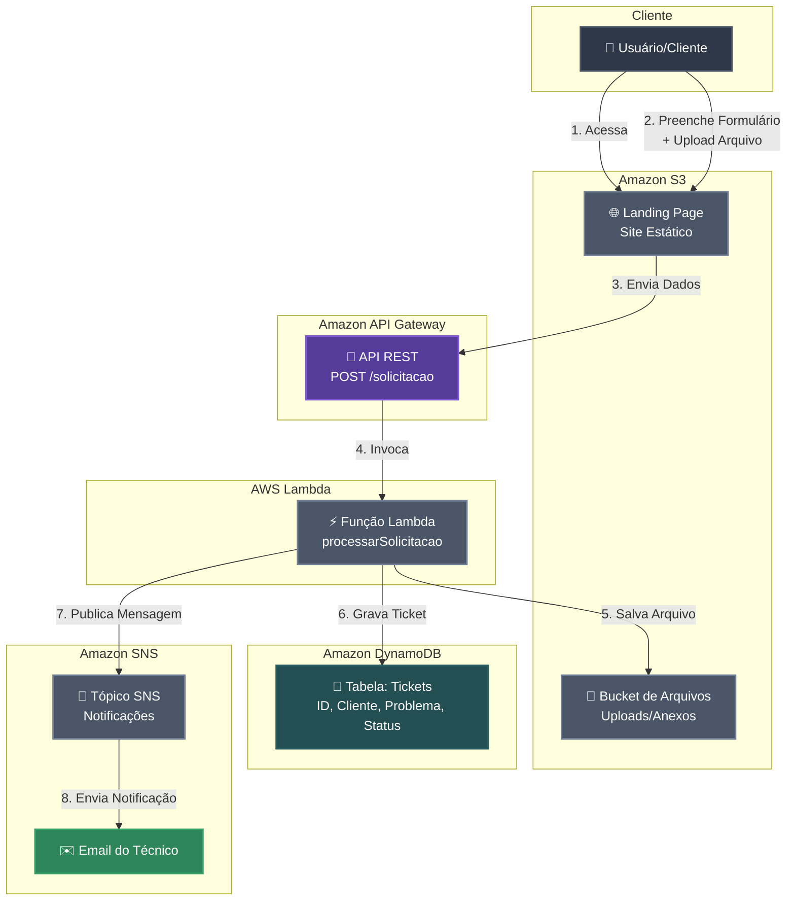

# SSSTI
Sistema de Solicitações de Suporte de TI

```mermaid

graph TB
    subgraph "Cliente"
        A[👤 Usuário/Cliente]
    end
    
    subgraph "Amazon S3"
        B[🌐 Landing Page<br/>Site Estático]
        C[📁 Bucket de Arquivos<br/>Uploads/Anexos]
    end
    
    subgraph "Amazon API Gateway"
        D[🔌 API REST<br/>POST /solicitacao]
    end
    
    subgraph "AWS Lambda"
        E[⚡ Função Lambda<br/>processarSolicitacao]
    end
    
    subgraph "Amazon DynamoDB"
        F[💾 Tabela: Tickets<br/>ID, Cliente, Problema, Status]
    end
    
    subgraph "Amazon SNS"
        G[📧 Tópico SNS<br/>Notificações]
        H[✉️ Email do Técnico]
    end
    
    A -->|1. Acessa| B
    A -->|2. Preenche Formulário<br/>+ Upload Arquivo| B
    B -->|3. Envia Dados| D
    D -->|4. Invoca| E
    E -->|5. Salva Arquivo| C
    E -->|6. Grava Ticket| F
    E -->|7. Publica Mensagem| G
    G -->|8. Envia Notificação| H
    
    style A fill:#2D3748,stroke:#4A5568,color:white,stroke-width:2px
    style B fill:#4A5568,stroke:#718096,color:white,stroke-width:2px
    style C fill:#4A5568,stroke:#718096,color:white,stroke-width:2px
    style D fill:#553C9A,stroke:#805AD5,color:white,stroke-width:2px
    style E fill:#4A5568,stroke:#718096,color:white,stroke-width:2px
    style F fill:#234E52,stroke:#285E61,color:white,stroke-width:2px
    style G fill:#4A5568,stroke:#718096,color:white,stroke-width:2px
    style H fill:#2F855A,stroke:#38A169,color:white,stroke-width:2px
    
    classDef aws fill:#ff9900,stroke:#232f3e,stroke-width:2px,color:#fff
    classDef client fill:#e1f5ff,stroke:#232f3e,stroke-width:2px
    classDef output fill:#90ee90,stroke:#232f3e,stroke-width:2px
```